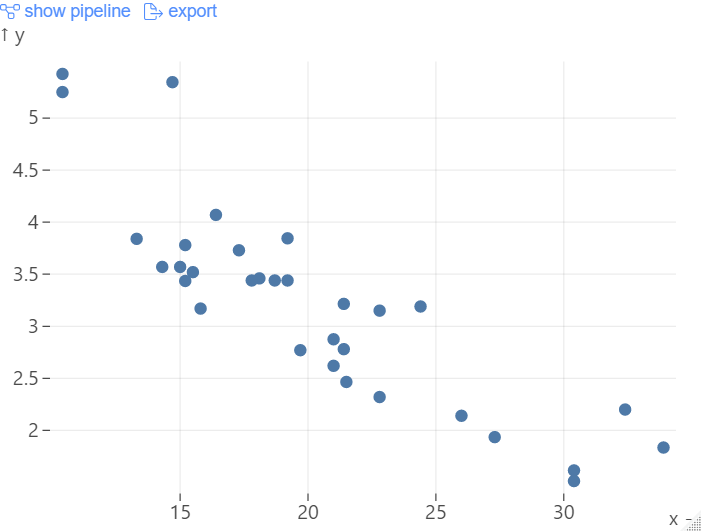

<!-- README.md is generated from README.Rmd. Please edit that file -->

```{r, include = FALSE}
knitr::opts_chunk$set(
  collapse = TRUE,
  eval = FALSE,
  echo = TRUE,
  comment = "#>",
  fig.path = "man/figures/README-",
  out.width = "100%"
)
```

# hal9 

<!-- badges: start -->
<!-- badges: end -->

The goal of hal9 is to provide R users a high-level hal9.js API.

## Installation

You can install the development version of hal9 from [GitHub](https://github.com/) with:

``` r
# install.packages("devtools")
devtools::install_github("hal9ai/hal9ai")
```

## Basic Usage

Hal9 is a javascript library that enables anyone to compose visualizations and predictive models optimized for websites and web APIs.

You can initialize `hal9` with an empty web app as follows:

```{r example}
library(hal9)

# create app
h9_create()
```

You may also add data as follows:

```{r data}
# load mtcars
h9_create() |>
  h9_load(mtcars)
```

You may also build a specific pipeline using our high-level chart functions:

```{r}
# plot mtcars
h9_create() |>
  h9_load(mtcars) |> 
  h9_scatter(x = "mpg", y = "wt")
```

```{r, eval = TRUE, echo = FALSE, out.width="50%", fig.align="center"}

```

## TO DO

- [ ] Test infrastructure
- [x] `h9_create()` first draft
- [x] `h9_add_step()` first draft
- [ ] Support to all steps

#### Examples

- [ ] R Markdown use case
- [ ] Shiny use case 
- [ ] Stats/ML use case
- [ ] Publishing hal9 vignette (rpubs, shinyapps, stand alone html)
