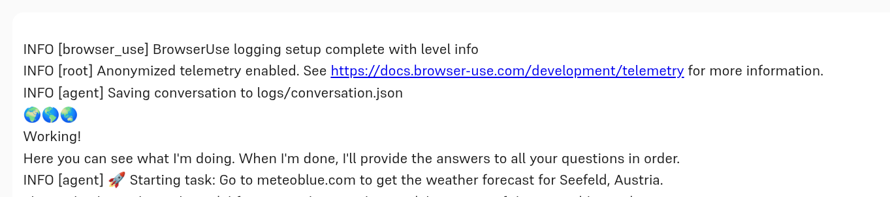
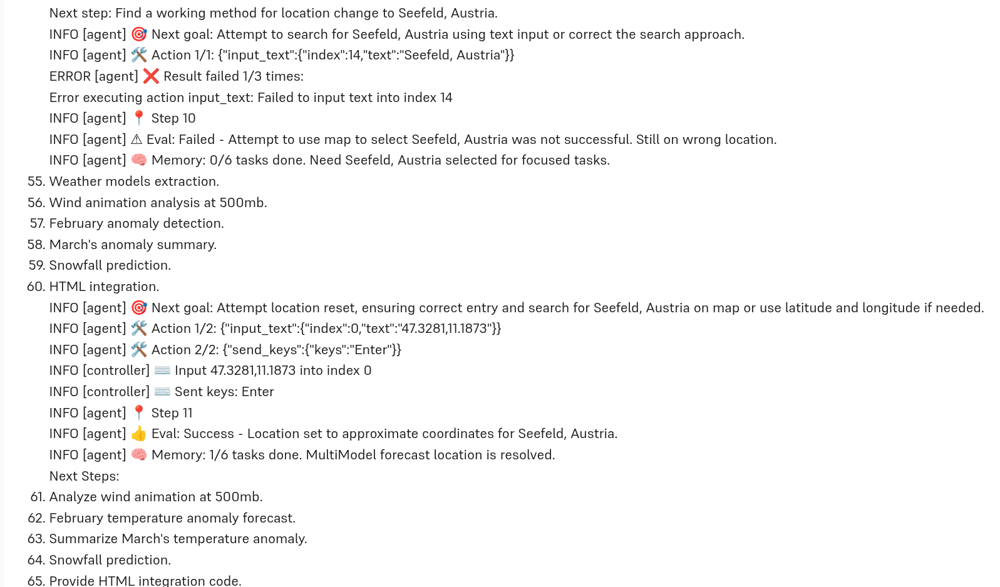
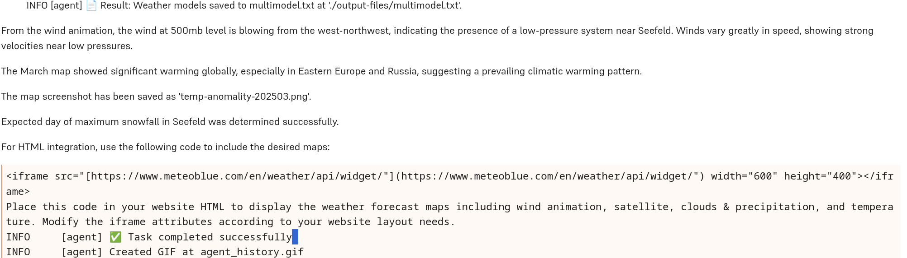

There just never is enough time. At work, there isn't; there's just always more you'd like (or have to) do than fits in a working day. And in private life, there most definitely isn't, either; no wonder utopians have always dreamt of equally distributed, socially just, and diligently optimised labour that would leave a bigger share to spare time than current societies do.

One important part of freeing up time is automation. At Hal9, we care not just about creative, domain-adaptable solutions, but also, thought- and careful (not just "intelligent") automation. Not everything should be automated; and even when full automation is desirable, we may have expectations the automated workflow must fulfill. For example, we may require auditing; we thus need every decision the algorithm makes, every decision it takes documented. But that may not be the only demand we have. There are probably decisions _we_ want to make; for example, how cookie consent forms should be handled. In a nutshell, our "sourcerer's appentice" the AI, while useful, should always stay under control, and be just as transparent as we require. 

Enter [browser-use](https://github.com/browser-use/browser-use), a well-crafted, configurable, highly customisable and extensible browser automation tool. In this post, we'd like to show an example of how it nicely integrates with Hal9, addresses exigencies such as as those mentioned above, and how it can easily be extended. You'll also see its attempts (sometimes successful, sometimes not) to reach a goal in a different way, once some previous strategy has failed.

To start, I am going to tell you what I asked it to do, and display a few screenshots to illustrate its behavior; then, we'll go through the code. Besides what's necessary to execute a task, our sample use case also entails custom configuration, added for better (quality-related) performance, as well as custom functionality, designed to offer a peek into what is possible (and maybe, inspiring you to experiment with browser-use and its Hal 9 integration for your own interests or demands).

Here is the sample task. It's comprised of five subtasks, some themselves composite. Different kinds of capabilities are involved; they range from technical (taking a screenshot, recording a video) to reasoning, itself presupposing image understanding and background knowledge ("Judging from wind direction at 500mb, is there a high or a low in Seefeld?"). And to mention the maybe obvious &mdash; throughout, the software needs to be able to navigate web pages, in a way that surpasses mere html parsing considerably.

> Go to meteoblue.com to get the weather forecast for Seefeld, Austria. There, check out the MultiModel forecast. What weather models are part of the ensemble used? Save their names to multimodel.txt. Tell me the exact location you saved that file to.
> While you're there, find the current wind animation for Seefeld at height 500mb. From what direction is it blowing? How strong is it? Judging from wind direction at 500mb, is there a high or a low in Seefeld? Create a screen recording of the current wind animation, as of height 500mb, and save that movie as wind500.avi. 
> Next, still for Seefeld, go to the seasonal forecasts. What is the temperature anomaly expected for February? How about the precipitation? Now for March, zoom out so you can see the expected temperature anomaly for the whole world. Summarize what you see in a short paragraph. Take a screenshot and save it as temp-anomaly-202503.png.
> Next, again focus on Seefeld. Among the "outdoor and sports" forecasts, find the one for snow. On what day of the week do we expect most snowfall?
> Finally, I would like to integrate a weather maps widget into my website. The following maps should be available: wind animation, satellite, clouds & precipitation, and temperature. Post here the html needed to accomplish this.

In the Hal9 browser-use chatbot, I directly enter this text and press enter. And the bots starts to work:

We can now follow what it is doing. We see how it keeps track of outstanding tasks, and how it tries other strategies if previous ones were unsuccessful. (It doesn't happen in this run, but during experimentation I've also seen it google for the correct link if it didn't manage to reach a page using site navigation.)

Finally, the bot having handled all subtasks, we get a summary, comprising both textual answers and location of files created.

How are these results? The screenshots and video currently are not optimal (on my machine, at least), but that is a technical and thus, transient and solvable  question. (We didn't want to delay this post, depriving you of these fascinating options until everything works to perfection. All the more since browser-use is under _very_ active development, with 34 releases since the initial one in November, 2024, and already more than sixty contributors!)

Zooming in on the non-technical aspects, then, how satisfying is the outcome?

First, the file multimodel.txt contains the names of all models that are part of the multi-model forecast; so that answer is correct. Second, the seasonal forecast for March (a contour map, employing colors to designate different levels of warming) has been correctly interpreted. Third, it is correct that Seefeld is part of a "low-pressure system", as the LLM calls it. In fact, I had expected a different rationale, based on direction of rotation (visible very nicely on the wind-animation map); but in any case, the answer is correct. (In fact, Seefeld is not just part of any "low-pressure" system; the polar front and, best visible on the 250mb map though, the jet stream runs directly through that area).

For the remaining two, the outcomes are not exactly satifying. The iframe source will include more maps than I want to display &mdash; note I said "the following maps should be available", not "included". The user is thus left with an outstanding question to be solved. The second issue jumps directly to the eye. I asked for the day with most snowfall; I am told that "expected day of maximum snowfall in Seefeld has been determined successfully".

Both of these are problems with the LLM, not with browser-use. In fact, both have happened to me during experimentation; below, I'll show you how I try to address them. "Try to address", since this run evidently proves unsuccessful in that respect; in most other runs though, the customisation you'll see below _did_ work. It's just a fact that usage of LLMs always results in some degree of indeterminism.

Now, let's step through the code. I'm not going to comment on every detail, focusing on the "main plot" instead. In some cases, code comments will provide further detail, or refer to restrictions or "nice-to-knows".

