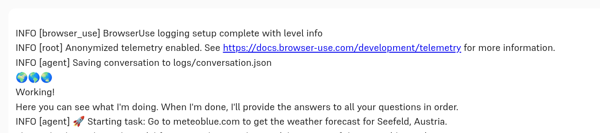
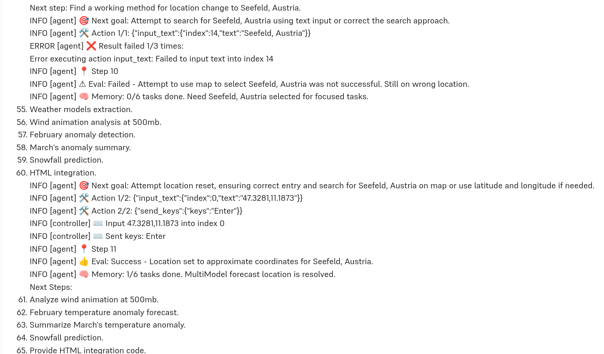
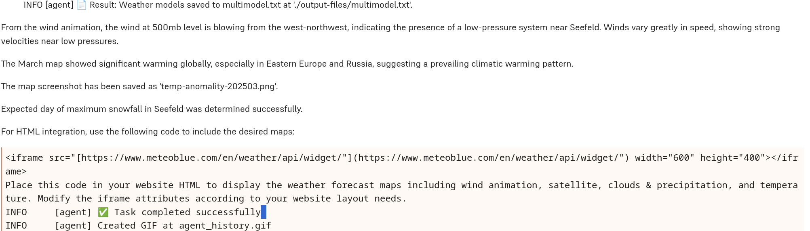

import ThemedImage from '../../src/components/themedimg.jsx'

There just never is enough time. At work, there isn't; there's just always more you'd like (or have to) do than fits in a working day. And in private life, there most definitely isn't, either; no wonder utopians have always dreamt of equally distributed, socially just, and diligently optimised labour that would leave a bigger share to spare time than current societies do.

One important part of freeing up time is automation. At Hal9, we care not just about creative, domain-adaptable solutions, but thought- and careful (not just "intelligent"!) automation, as well. Not everything should be automated; and even when full automation is desirable, we may have expectations the automated workflow must fulfill. For example, we may require auditing; we'd thus need every decision the algorithm makes, every decision it takes, documented. But that may not be our only demand. There likely are decisions _we_ want to make; for example, how cookie consent forms should be handled. In a nutshell, our "sourcerer's appentice" the AI, while useful, should always stay under control, and be just as transparent as we require. 

Enter [browser-use](https://github.com/browser-use/browser-use), a well-crafted, configurable, highly customisable and extensible browser automation tool. In this post, we'd like to show an example of how it nicely integrates with Hal9, addresses exigencies such as as those mentioned above, and may easily be extended. You'll also see its attempts (sometimes successful, sometimes not) to reach a goal in a different way, once some previous strategy has failed. And when it's finished, it automatically creates an animated gif showing you how it proceeded.

<center style={{display: 'none'}}><ThemedImage src="agent-history-preview"/></center>
[](https://hal9.com/apps/browseruse)

To start, I am going to tell you what I asked it to do, and display a few screenshots to illustrate its behavior; then, we'll go through the code. Besides what's necessary to execute a task, our sample use case also entails custom configuration as well as custom functionality, designed to offer a peek into what is possible (and maybe, inspiring you to experiment with browser-use and its Hal 9 integration for your own interests or demands).

Here is the sample task. It's comprised of five subtasks, some themselves composite. Different kinds of capabilities are involved; they range from technical (taking a screenshot, recording a video) to reasoning, reasoning that itself presupposes image understanding and background knowledge ("Judging from wind direction at 500mb, is there a high or a low in Seefeld?"). And, to mention the maybe obvious &mdash; throughout, the software needs to be able to navigate web pages, in a way that surpasses mere html parsing considerably.

> Go to meteoblue.com to get the weather forecast for Seefeld, Austria. There, check out the MultiModel forecast. What weather models are part of the ensemble used? Save their names to multimodel.txt. Tell me the exact location you saved that file to.
> While you're there, find the current wind animation for Seefeld at height 500mb. From what direction is it blowing? How strong is it? Judging from wind direction at 500mb, is there a high or a low in Seefeld? Create a screen recording of the current wind animation, as of height 500mb, and save that movie as wind500.avi. 
> Next, still for Seefeld, go to the seasonal forecasts. What is the temperature anomaly expected for February? How about the precipitation? Now for March, zoom out so you can see the expected temperature anomaly for the whole world. Summarize what you see in a short paragraph. Take a screenshot and save it as temp-anomaly-202503.png.
> Next, again focus on Seefeld. Among the "outdoor and sports" forecasts, find the one for snow. On what day of the week do we expect most snowfall?
> Finally, I would like to integrate a weather maps widget into my website. The following maps should be available: wind animation, satellite, clouds & precipitation, and temperature. Post here the html needed to accomplish this.

In the Hal9 browser-use chatbot, I directly enter this text and press enter. And the bots starts to work:



We can now follow what it is doing. We see how it keeps track of outstanding tasks, and how it tries other strategies if previous ones were unsuccessful. (It doesn't happen in this run, but during experimentation I've also seen it google for the correct link if it didn't manage to reach a page using site navigation.)



Finally, the bot having handled all subtasks, we get a summary, comprising both textual answers and location of files created.



How are these results? The screenshots and video currently are not optimal (on my machine, at least), but that is a technical and thus, transient and solvable  question. (We didn't want to delay this post, depriving you of such fascinating options, until everything works to perfection. All the more since browser-use is under _very_ active development, with 34 releases since the initial one in November, 2024, and already more than sixty contributors!)

Zooming in on the non-technical aspects, then, how satisfying is the outcome?

First, the file multimodel.txt contains the names of all models that are part of the multi-model forecast; so that answer is correct. Second, the seasonal forecast for March (a contour map, employing colors to designate different levels of warming) has been correctly interpreted. Third, it is correct that Seefeld is part of a "low-pressure system", as the LLM calls it. In fact, I had expected a different rationale, based on direction of rotation (visible very nicely on the wind-animation map); but in any case, the answer is correct. (In fact, Seefeld is not just part of any "low-pressure" system; the polar front and, best visible on the 250mb map though, the jet stream run directly through that area).

For the remaining two, the outcomes are not exactly satifying. The iframe source will include more maps than I want to display &mdash; note I said "the following maps should be available", not "included". The user is thus left with an outstanding question to be solved. The second issue jumps directly to the eye. I asked for the day with most snowfall; I am told that "expected day of maximum snowfall in Seefeld has been determined successfully".

Both of these are problems with the LLM, not with browser-use. In fact, both have happened to me during experimentation; below, I'll show you how I try to address them. "Try to address", since this run evidently proves unsuccessful in that respect; in most other runs though, the customisation you'll see below _did_ work. It's just a fact that usage of LLMs always results in some degree of indeterminism.

Now, let's step through the code. I'm not going to comment on every detail, but focus on the "main plot" instead. In some cases, code comments will provide further detail, refer to restrictions, or give pointers to related materials.

Here, first, are the imports.

``` python
# import hal9
import hal9 as h9

# import Python packages
import subprocess
import asyncio
import sys
import os
import shutil
import numpy as np
import cv2
from dotenv import load_dotenv

# use OpenAI as LLM
from langchain_openai import ChatOpenAI

# browser-use imports
from browser_use import Agent, Browser, BrowserConfig, SystemPrompt, ActionResult
from browser_use.browser.context import BrowserContextConfig, BrowserContext
from browser_use.agent.service import Agent
from browser_use.controller.service import Controller

# temporarily use pyautogui until https://github.com/browser-use/browser-use/issues/714 has been solved
import pyautogui
# grant display access permission needed for screenshot
# will be needed when switching to BrowserContext.take_screenshot()  
# import base64 as b64
```

Next, finish setup. The second step is required, since browser-use utilises [Playwright](https://playwright.dev/), a framework for automated web testing.
The first is about authorizing the application user to access the screen, such that screenshots may be taken. On Linux, this is required; if you use MacOS or Windows, you will have to test, and possibly find out how to grant that permission.

``` python
# tested on Linux - users of other OSes will need to find out
# whether it's required, and what works there
response= subprocess.call(["xhost", "+local:"], stdout=subprocess.DEVNULL, stderr=subprocess.STDOUT)
if response != 0: sys.exit("Couldn't authorize local users to access screen.")

response = subprocess.call(["playwright", "install"], stdout = subprocess.DEVNULL, stderr = subprocess.STDOUT)
if response != 0: sys.exit("Couldn't install playwright!")

```

Set a few variables. The browser size variables will be commented on shortly.

``` python
# use these when reverting to BrowserContext.take_screenshot()
#browserWidth = 640
#browserHeight = 360
browserWidth = 2560
browserHeight = 1440

dir = './output-files/'
if os.path.exists(dir):
    shutil.rmtree(dir)
os.makedirs(dir)
```

Now, we come to the fun stuff. There are two types of customization I have made. The first is extending the system prompt. browser-use comes with a detailed system prompt, encompassing, among others, rules for website navigation, image processing, and response format. We can conveniently extend the SystemPrompt class, adding our own rules.

Here, I'm adding three rules, one related to custom functionality, and two that are based on issues I encountered during experimentation. 

The latter two are rules 9 and 11. One thing that happened to me was being left with a link, not an answer. Having added rule 9, I never ran into this anymore. However, the rule was also meant to ensure I get what I want when I ask about website integration (the iframe code). Specifically, I added "EXACTLY" to the phrase that, before, was about completeness only. And sometimes, this _did_ work out; in others, it did not.

The other one turned out essential for getting this to work. Initially, when the bot had exceeded the (configurable) number of tries to achieve a goal, it would simply give up on the whole task &mdash; irrespectively of whether remaining subtasks were dependent on that one or not. After adding rule 11, this did not happen anymore.

Rule 10 is different. I want to have screenshots taken and a movie recorded; to that purpose, I provide functions that implement the desired functionality. In such a case, we need to inform the LLM explicitly which function to utilise.

``` python
class CustomPrompt(SystemPrompt):
    def important_rules(self) -> str:
        # Get existing rules from parent class
        existing_rules = super().important_rules()

        # Add your custom rules
        new_rules = """
9. IMPORTANT FOR TEXTUAL ANSWERS:
- Make sure you answer a question EXACTLY and COMPLETELY.
  For example, if you are asked to enumerate a list of entities fulfilling some condition, list each and any of them.
  Always do actually provide the information you are asked for - never just post a link instead.

10. IMPORTANT FOR FILES YOU ARE ASKED TO CREATE:
- When you are asked to create a file, save it making use of the save_path you are given.
- You may be asked to create different types of files: text files, screenshots, and recordings.
- Screenshots should be saved as .png.
- Recordings should be saved as .avi.
- When asked to save content to a text file, make use of the function save_to_text_file.
- When asked to create a screenshot, make use of the function create_png.
- When asked to create a screen recording, make use of the function create_avi.

11. GENERAL RULE REGARDING SUBTASKS:
- When you are given a task involving several subtasks, and one of the subtasks fails, assess whether the other ones are dependent on its success.
  Do this for each subtask individually. If a subtask can be addressed without that prior one having been successfully, ALWAYS execute it.
  In other words, ONLY EVER skip a subtask if its requirements are not given.
"""

        # Make sure to use this pattern otherwise the existing rules will be lost
        return f'{existing_rules}\n{new_rules}'
```

The second customization in my code is, as you may already have expected by now, an extension that adds screenshotting and screen-recording facilities.
Such extensions, you'll see, are equally straightforwardly incorporated into browser-use. 

We create a `Controller` instance, and annotate custom functions with actions descriptive of what they we intend them to get used for.
The first such function is for saving text files in the directory where we want them to appear:

``` python
controller = Controller()

@controller.action('Save to text file') 
def save_to_text_file(text_content: str, save_path: str = './output-files/text.txt'):
    with open(save_path, 'w') as f: 
        f.write(text_content)
    return ActionResult(extracted_content = f'Text {text_content} written to {save_path}.')
```

Next, on to screenshots and screen recordings. The code displayed below is a temporary workaround for an &mdash; in theory &mdash; better-working one,  calling browser-use's own `BrowserContext.take_screenshot()` function. The problem with using `pyautogui.screenshot()` in this context is that, for one, the screenshot taken comprises the whole screen, not just the Playwright browser &mdash; this is why, above, I was employing the "hack" of setting the size of the Playwright browser to my laptop's screen size. And second, the screenshot will be taken of whatever application (or browser tab) is in the foreground in just that very moment.
(These issues are, in principle, solvable in some way, but unless your use case is very urgent, time might more productively be spent resolving the problem with `take_screenshot()`.)

What I just detailed holds analogously for `save_to_avi()`, since a recording here is nothing else than a sequence of screenshots. 

``` python
@controller.action('Create screenshot') 
async def save_to_png(description: str, save_path: str = './output-files/screenshot.png'):
    # temporarily use pyautogui until https://github.com/browser-use/browser-use/issues/714 has been solved
    pyautogui.screenshot(save_path, region=(0, 0, browserWidth, browserHeight))
    return ActionResult(extracted_content = f'Screenshot for {description} written to {save_path}.')

# following https://www.geeksforgeeks.org/create-a-screen-recorder-using-python/
@controller.action('Create recording') 
async def save_to_avi(description: str, save_path: str = './output-files/recording.avi'):
    resolution = (browserWidth, browserHeight)
    codec = cv2.VideoWriter_fourcc(*"XVID")
    fps = 10.0 

    out = cv2.VideoWriter(save_path, codec, fps, resolution)
    cv2.namedWindow("Live", cv2.WINDOW_NORMAL)

    remaining =  1 * int(fps)
    while (remaining > 0):
        img = pyautogui.screenshot(region=(0, 0, browserWidth, browserHeight))
        frame = np.array(img)
        frame = cv2.cvtColor(frame, cv2.COLOR_BGR2RGB)
        out.write(frame)
        remaining -= 1
    
    out.release()
    cv2.destroyAllWindows()
    return ActionResult(extracted_content = f'Recording for {description} written to {save_path}.')
```

Now, for the main browser-use functionality. The first snippet is hardly worth its own exhibit when `BrowserContext.take_screenshot()` is used. 

``` python
# only in pyautogui version 
browser = Browser(
	config=BrowserConfig(
		# for available options see
        # https://github.com/browser-use/browser-use/blob/5d1197e5d3b8b7d191aac638b052007882504040/browser_use/browser/browser.py#L178
        extra_chromium_args = [f'--window-position=0,0, --window-size={browserWidth},{browserHeight}'],
	)
)

# once we return to BrowserContext.take_screenshot()
# browser = Browser()
```

Neither is the following snippet required if no custom configuration is needed. 

``` python
config = BrowserContextConfig(
    browser_window_size = {'width': browserWidth, 'height': browserHeight},
    save_recording_path = "./output-files/",
)

context = BrowserContext(browser = browser, config = config)

```

Finally, for that part of code that _is_ required. (Well, apart from the `print()` statements, it is; and with just two arguments passed to `Agent()`.

``` python
async def run(agent):
    print("🌍🌎🌏") 
    print("Working!")
    print("Here you can see what I'm doing. When I'm done, I'll provide the answers to all your questions in order.")
    history = await agent.run()
    return history

async def main():
    prompt = h9.input()
    agent = Agent(
        browser_context = context,
        controller = controller,
        system_prompt_class = Save_Files,
        # these two arguments are needed
        task = prompt,
        llm = llm,
        save_conversation_path="logs/conversation.json" 
    )
    history = await run(agent)
    await browser.close()

asyncio.run(main())
```

You can try a simpler demo from [/apps/browseruse](https://hal9.com/apps/browseruse) and check out the code in our [GitHub repo](https://github.com/hal9ai/hal9/blob/main/apps/browser-use/app.py).

And that's it! I hope this writeup has given you an idea of just _how_ many things you could get done for you this way. Automating away some of the nuisances of life is just one aspect; another type of task (one my example is merely a feeble preview of) would be to have browser-use automate information retrieval, and then make use of the LLM to obtain a detailed analysis. And all that, if you like, seemlessly integrated into the chatbot infrastructure afforded by Hal9!
