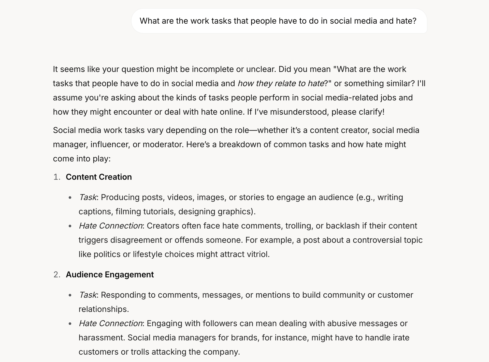
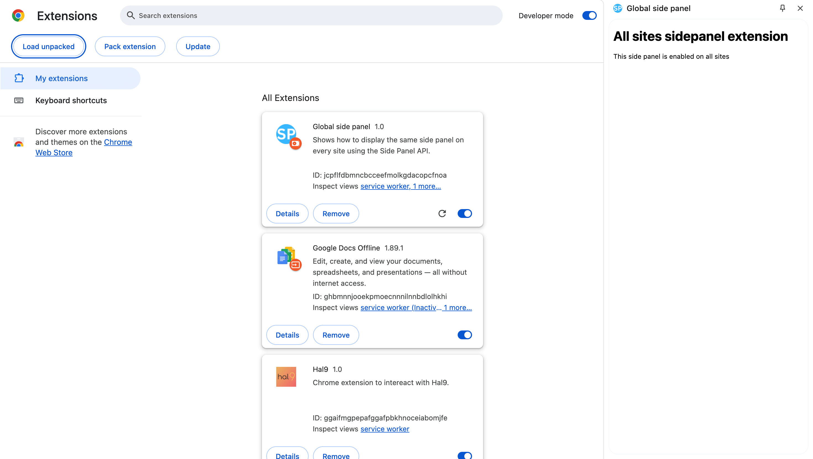
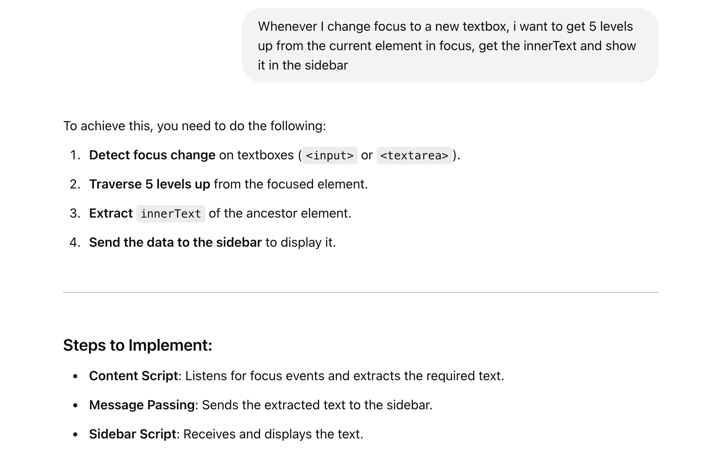
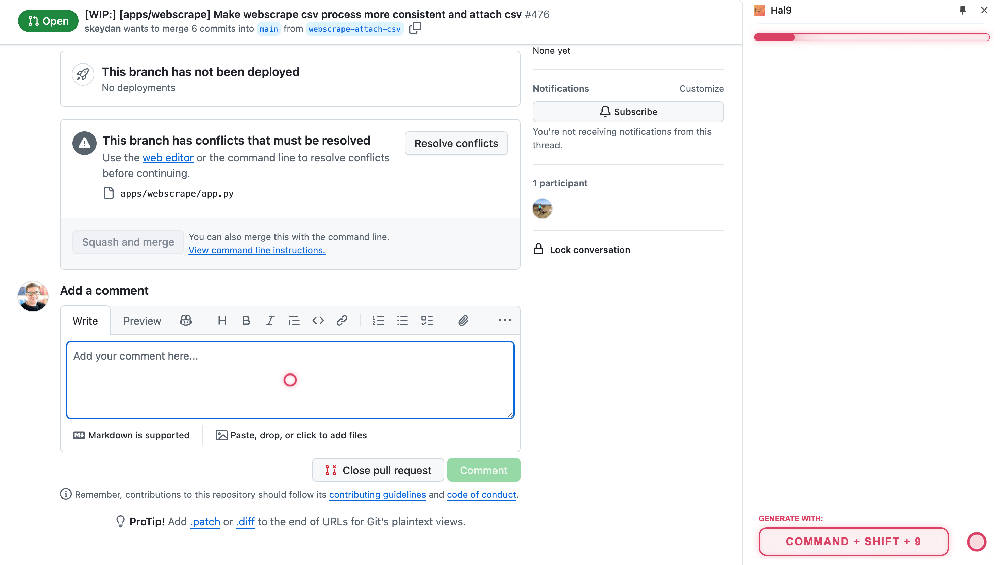
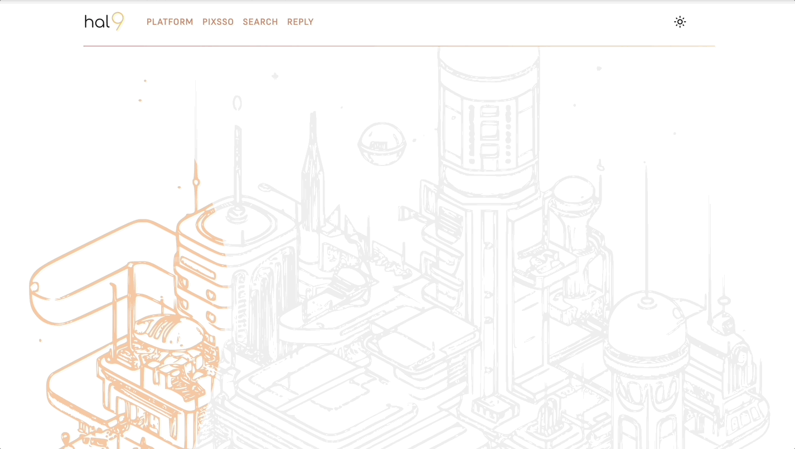
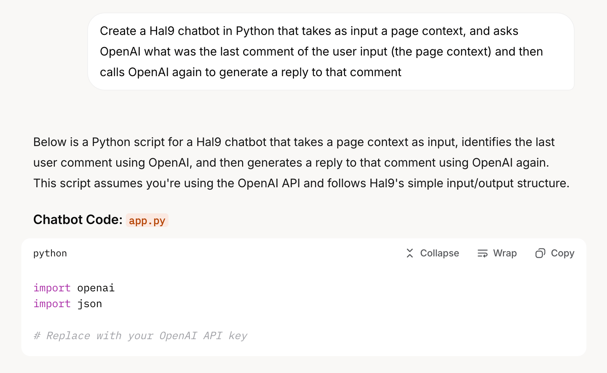
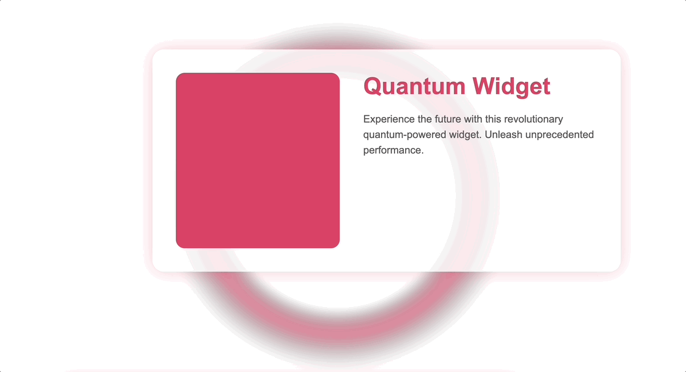
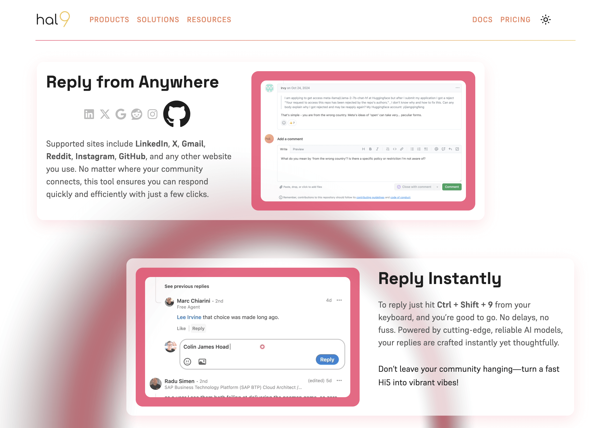
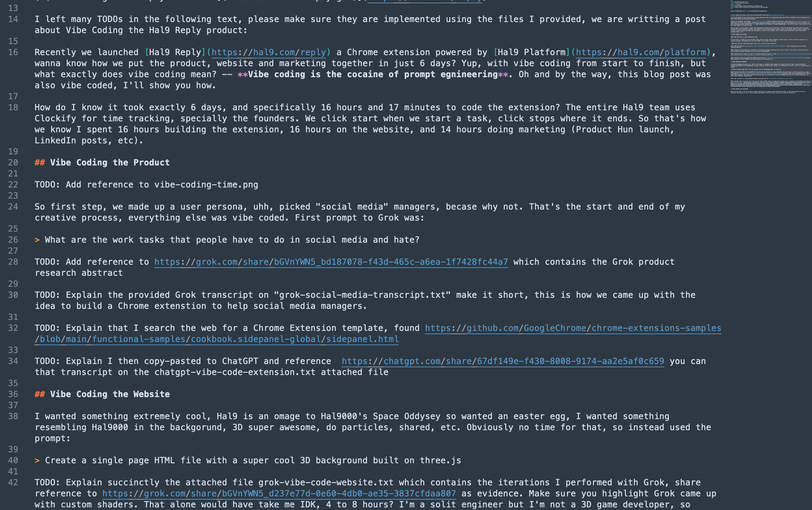
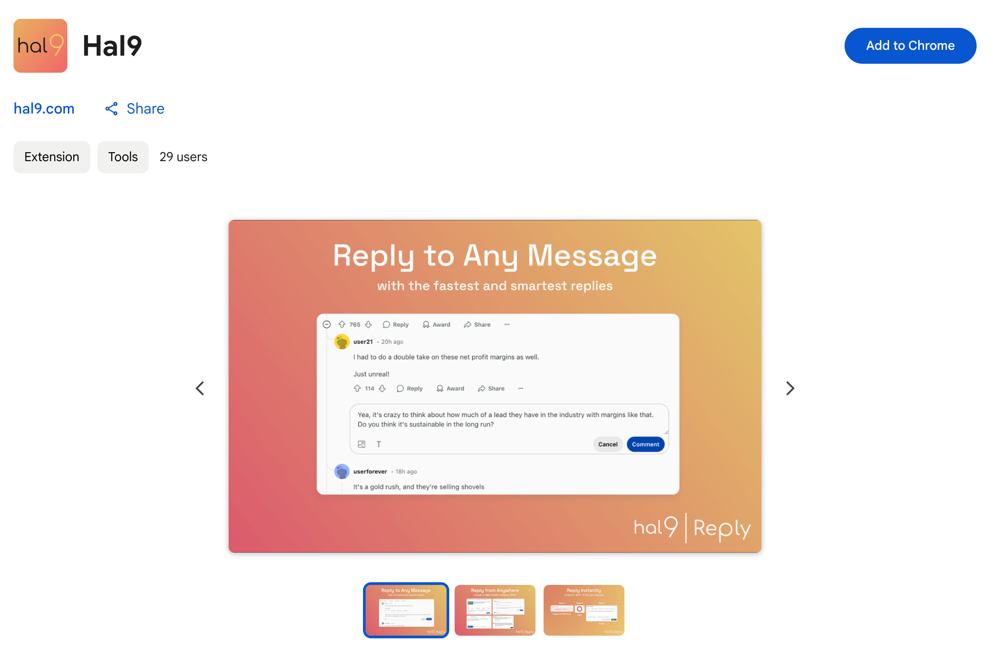

import ThemedImage from '../../src/components/themedimg.jsx'

# Vibe Coding a Product in 6 Days

Recently, we launched [Hal9 Reply](https://hal9.com/reply), a [Chrome extension](https://chromewebstore.google.com/detail/hal9/ggaifmgpepafggafpbkhnoceiabomjfe) powered by the [Hal9 Platform](https://hal9.com/platform). Want to know how we pulled off the product, website, and marketing in just 6 days?

[](https://hal9.com/reply)

The answer is **vibe coding**—a fast, AI-driven approach we like to call **the cocaine of prompt engineering**. Oh, and by the way, this blog post was vibe coded too. Let me walk you through how we did it.

How do we know it took exactly 6 days? The Hal9 team, especially the founders, tracks every minute using Clockify. We start the timer when a task begins and stop it when it’s done. That’s how we clocked 16 hours building the extension, 16 hours on the website, and 14 hours on marketing efforts like the [Product Hunt](https://www.producthunt.com/products/hal9-reply) launch and [Hal9's LinkedIn](https://www.linkedin.com/company/hal9) posts.


## Vibe Coding the Product

### Market Research

Our journey started with a simple idea: build something for social media managers. That was the extent of our initial creative spark—everything else was vibe coded. We kicked off by asking Grok:

> What are the work tasks that people have to do in social media and hate?

The response from Grok ([see transcript here](https://grok.com/share/bGVnYWN5_bd187078-f43d-465c-a6ea-1f7428fc44a7)) sparked the idea. Social media managers drown in repetitive engagement tasks—responding to comments, messages, and mentions. They hate the grind, especially when overwhelmed. That’s when it hit me: a Chrome extension to lighten the load.

[](https://grok.com/share/bGVnYWN5_bd187078-f43d-465c-a6ea-1f7428fc44a7)

The Grok conversation dug into personas like the “Overworked Manager” and “Big-Name Influencer,” revealing a pain point: too many replies, not enough time. One follow-up question—“When they’re overwhelmed with replies, what Google searches would they do?”—led to insights like “tools to manage social media comments quickly.” **Bingo. Hal9 Reply was born**: a side panel to display context from the page, helping managers craft faster, smarter replies.

### Frontend Code

Next, I needed a starting point. I scoured the web and found a Chrome extension template on GitHub ([this side panel sample](https://github.com/GoogleChrome/chrome-extensions-samples/blob/main/functional-samples/cookbook.sidepanel-global/sidepanel.html)). Simple HTML, a bit of JS—perfect.

[](https://github.com/GoogleChrome/chrome-extensions-samples/blob/main/functional-samples/cookbook.sidepanel-global/sidepanel.html)

I copied it, pasted it into ChatGPT, and asked:

> Make this show the text from 5 levels up when I focus on a textbox.

The development process was iterative—errors like “Extension context invalidated” surfaced—but after adjusting the manifest and adding tab-specific logic, we nailed it. The final version captures context from ancestors and previous siblings, stops at the body tag, and skips hidden elements like scripts. It took about 4 hours to get it running, though unpolished.

[](https://chatgpt.com/share/67df149e-f430-8008-9174-aa2e5af0c659)

The next 12 hours went into testing and refinement. We tested completion across multiple websites, fixed issues as they came up, and polished the UX to perfection. Highlights include a slick animation and a breathing effect during text completion. The result? A flawless product, now live in our [Hal9 GitHub](https://github.com/hal9ai/hal9) repo.

Total time: 14 hours. The outcome: an extremely polished final product! But wait, backend missing and we have only 2 hours left!

[](https://hal9.com/reply)

### Backend Code

Need a backend? At Hal9, we’ve got you covered! You can create and deploy a Python chatbot in just 10 seconds. Here’s how: Head to the [Hal9 Platform](https://hal9.com/platform), click the "Create" tab, and then "Create" button. Done! You’ve got a Python chatbot—editable and [deployable from GitHub](https://hal9.com/docs/learn/code/github).

<center>
[](https://hal9.com)
</center>

This chatbot comes with an API which we hooked into the extension frontend code with the following:

```js
async function completeText(text) {
  const url = 'https://api.hal9.com/api/v1/chats/message';
  const body = { path: 'apps/chrome', message: text };

  const response = await fetch(url, {
    method: 'POST',
    headers: { 'Content-Type': 'application/json', apikey: '' },
    body: JSON.stringify(body),
  });

  return (await response.json()).message;
}
````

But the initial replies? Not great. The page context was too long, and the bot struggled to respond accurately. The fix? A quick vibe-code session with a simple RAG (Retrieval Augmented Generation) approach. RAG boosts AI performance using targeted Python code. No need to dig through [Hal9’s docs](https://hal9.com/docs)—we used this prompt instead:

> Create a Hal9 chatbot in Python that takes a page context as input, asks OpenAI to identify the last user comment in that context, then calls OpenAI again to generate a reply to it.



The generated code was solid, but we wanted speed. So, we swapped OpenAI for [Groq](https://groq.com/)—yes, with a Q. Groq’s custom AI chip delivers faster LLMs. Here’s the final code:

The final code looks as follows. Feel free to click the "deploy" button in the code and push it to Hal9 for you to try, it's that easy.

``````python deploy
import os
from groq import Groq

client = Groq(base_url="https://api.hal9.com/proxy/server=https://api.groq.com/", api_key = "anykey")
model = "llama3-70b-8192"

context = input()

prompt = f"""Given the following website:

```
{context[-8192:] if len(context) > 8192 else context}
```

What is the conversation about and what was the last comment?
"""

messages = [
  {"role": "system", "content": "Your main goal is to reply as a human, you are a human."},
  {"role": "user", "content": prompt}
]

completion = client.chat.completions.create(model = model, messages = messages)
last = completion.choices[0].message.content

messages.append({ "role": "assistant", "content": last })
messages.append({ "role": "user", "content": "Given the last comment, what's a reasonable comment that anyone might reply to, related to the last comment only? Reply only with comment in the language of the conversation" })

completion = client.chat.completions.create(model = model, messages = messages)

resposne = completion.choices[0].message.content
print(f"{resposne}")
``````

## Vibe Coding the Website

For the website, I wanted something epic—an homage to HAL 9000 from *2001: A Space Odyssey*. Picture a 3D background with a glowing, pulsating donut shape and orbiting particles. But with only 6 days, building that from scratch was out of the question. So, I turned to Grok with this prompt:

> Create a single page HTML file with a super cool 3D background built on three.js

The process was iterative brilliance ([check the evidence](https://grok.com/share/bGVnYWN5_d237e77d-0e60-4db0-ae35-3837cfdaa807)). Grok spat out a Three.js setup with a flat donut (not a torus), orbiting particles, and custom shaders for pulsating glow. That shader magic—pumping out a gradient from black edges to a vibrant `#da4266` would’ve taken me 4-8 hours alone, at least! With Grok I nailed it in minutes.

With Grok we hit a Content Security Policy error blocking Three.js, but Hal9’s platform saved the day, letting me finalize it there.

[](https://hal9.com/apps/vibe-code-website)

The result? A fixed-canvas, white-background masterpiece with a breathing donut and glowing particles, all scaling perfectly to the viewport ([see it live](https://hal9.com/apps/vibe-code-website)). I plugged it into our Vue-based main site, added some fade-in animations for product listings (odd left, even right), and called it done—16 hours total.

## Vibe Coding the Marketing

With the product and website ready, we needed a marketing video—fast. Our solution? Animate the website, add background music, and throw in a voice-over. Done.



For animations, we used Vue. Here’s a sample fade-in effect from the process ([transcript reference](https://grok.com/share/bGVnYWN5_f0560e1c-029b-48eb-9c38-e23d398f8dc5)):

```html
<transition name="fade">
  <span>
    <a href="https://www.sciencedirect.com/science/article/abs/pii/S0747563212001203">Studies</a>
    show that engaging with your community with quick replies can 
    <b>strengthen relationships and drive word-of-mouth growth</b>.
  </span>
</transition>

<style>
.fade-enter-active {
  transition: opacity 1s ease-in-out;
}
.fade-enter {
  opacity: 0;
}
</style>
```

The voice-over came from [ElevenLabs](https://elevenlabs.io/) with this prompt:

> British accent female with upbeat happy and fast voice, a bit sassy

We screencammed the animated website, layered in the voice-over and music, and that became our launch video. From there, vibe coding carried us through the launch. Grok whipped up a Product Hunt page draft, we used Hal9 Reply to respond to early feedback, and I churned out LinkedIn and Twitter posts.

The final touch? This blog post. I started with a rough draft, fed it to Grok with “Polish this and fill in the TODOs” and iterated until it flowed.



## Conclusion

In just 6 days, we turned a vague idea into a launched product, complete with a stunning website and marketing materials—all thanks to vibe coding. Tools like Grok and Hal9 supercharged our workflow, proving that AI can be a game-changer for rapid development. Want to build something fast? Vibe coding might be just what you need.

[](https://chromewebstore.google.com/detail/hal9/ggaifmgpepafggafpbkhnoceiabomjfe)