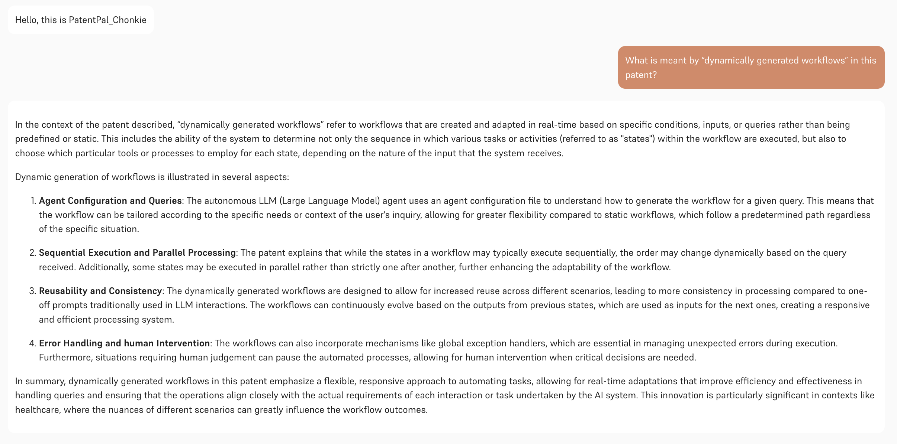

import ThemedImage from '../../src/components/themedimg.jsx'

## Introduction  
In the fast-paced world of Retrieval-Augmented Generation (RAG) applications, preprocessing text into meaningful, manageable chunks is a critical yet often cumbersome task. Enter **Chonkie**, a lightweight, lightning-fast, and feature-rich chunking library designed to simplify this process. Paired with **Hal9**, a powerful platform for deploying AI-powered solutions, Chonkie becomes an even more formidable tool for building efficient, scalable, and production-ready AI applications. In this blog post, we’ll dive into what Chonkie is, explore its use cases, and demonstrate how Hal9 complements it to create seamless, high-performance RAG pipelines.  

## What is Chonkie?  
Chonkie is an open-source, YC-backed semantic chunking library and cloud service tailored for RAG and AI applications that tackles the complexity of text preprocessing with elegance and efficiency. Its core mission is to make the process of breaking down large texts into smaller, meaningful pieces—simple, fast, and flexible.  

### Key Features of Chonkie  
- **Lightweight**: At just 9.7MB for its base installation, Chonkie minimizes bloat while delivering robust functionality.  
- **Lightning Fast**: Optimized with pipelining, caching, and parallel processing, Chonkie processes texts at breakneck speed without compromising quality.  
- **Feature-Rich**: Supports multiple chunking strategies, including TokenChunker, SentenceChunker, SemanticChunker, and even CodeChunker for source code.  
- **Flexible**: Works with various tokenizers, models, and APIs, and supports both local and cloud-based processing via Chonkie Cloud.  
- **Easy to Use**: With a simple “Install, Import, CHONK” workflow, developers can get started in minutes.  

Chonkie’s chunking strategies are designed to produce **reconstructable**, **independent**, and **sufficient** chunks, ensuring that each piece of text is meaningful, standalone, and optimized for RAG workflows. Whether you’re chunking PDFs, web pages, or code, Chonkie handles diverse data formats with ease, reducing token usage by up to 75%, speeding up response times, and improving model accuracy.  

### Why Chunking Matters  
Chunking is essential for RAG applications for several reasons:  
1. **Context Window Limitations**: Large language models (LLMs) have finite context windows, and chunking ensures texts fit within these limits.  
2. **Computational Efficiency**: Processing smaller chunks reduces computational costs, making queries faster and more memory-efficient.  
3. **Better Representation**: Independent chunks focus on single ideas, improving model understanding and reducing conflation of concepts.  
4. **Reduced Hallucination**: Smaller, focused chunks minimize the risk of models generating irrelevant or incorrect responses.  

Chonkie’s optimized chunkers, like SemanticChunker and SlumberChunker, leverage advanced techniques such as semantic similarity and generative models to ensure high-quality chunks tailored to specific use cases.  

## What Can You Use Chonkie For?  
Chonkie is a versatile tool that powers a wide range of RAG and AI applications. Here are some key use cases:  

1. **Document Processing for Chatbots**: Chunk legal documents, research papers, or user manuals into manageable pieces for precise, context-aware responses.  
2. **Code Analysis**: Use CodeChunker to break down source code into semantically meaningful units for AI-driven code review or documentation generation.  
3. **Web Content Summarization**: Process web pages into concise chunks for summarization or question-answering systems.  
4. **Knowledge Base Creation**: Prepare structured data for vector databases, enabling efficient retrieval for enterprise search or customer support systems.  
5. **Multilingual Applications**: Combine Chonkie with cloud-based processing to handle diverse languages and formats seamlessly.  

By integrating with vector databases and embedding strategies, Chonkie ensures that your data is AI-ready, making it a go-to solution for developers building intelligent, scalable applications.  

## How Hal9 Complements Chonkie  
While Chonkie excels at preprocessing and chunking, **Hal9** takes the baton to streamline deployment, scaling, and visualization of AI applications. Hal9 is a user-friendly platform designed to make AI solutions production-ready with minimal friction. Together, Chonkie and Hal9 form a powerful duo for building robust RAG pipelines.  

### The Hal9 Advantage  
- **Seamless Deployment**: Hal9 simplifies the transition from development to production with a single command, ensuring your Chonkie-powered applications are live in seconds.  
- **Scalability**: Handle high user traffic without compromising performance, making it ideal for enterprise-grade solutions.  
- **Visualization and Debugging**: Hal9’s intuitive interface allows you to visualize chunking workflows and monitor performance, ensuring your application runs smoothly.  
- **Accessibility**: Hal9’s platform is designed for developers of all skill levels, making it easy to integrate Chonkie’s chunking capabilities into complex workflows.  

## Demonstrating Chonkie in Action: Streamlit App and Chatbot Comparison
To illustrate Chonkie’s capabilities, we built a streamlit app deployed on Hal9 that allows users to experiment with different chunking strategies and visualize the results. Additionally, we created two chatbots—one using Chonkie for chunking and another using a basic word-based splitting method to compare their performance in a RAG pipeline.

### Streamlit App for Chunking Visualization
The Streamlit app provides an interactive interface to test Chonkie’s chunking strategies. Users can select a chunker (e.g., RecursiveChunker, SentenceChunker, TokenChunker, or SemanticChunker), adjust chunk size and overlap, and input text either manually or by uploading a file (e.g., .txt, .md, or .pdf). The app processes the text using Chonkie’s API and displays the resulting chunks, allowing users to download them as a .txt file. 

This app demonstrates Chonkie’s API ease of use and flexibility, allowing developers to experiment with different chunking strategies and see immediate results. You can try it out anc check the code on Hal9’s platform at [Chonkie - Streamlit App](https://hal9.com/brenda/chonkie_demo).

### Chatbot Comparison: Chonkie vs. Basic Splitting
To evaluate Chonkie’s impact, we built two chatbots that process a PDF document, in this case patents file, and answer user queries using a RAG pipeline. Both chatbots use OpenAI’s `text-embedding-3-small` for embeddings and `gpt-4o-mini` for response generation, but they differ in their chunking approach:

1. **Chonkie-Powered Chatbot**: Uses Chonkie’s `SemanticChunker` to split the PDF into chunks of 300 tokens with a 30-token overlap. The chunker ensures semantically coherent and reconstructable chunks, optimized for RAG.
2. **Basic Chatbot**: Uses a simple word-based splitting function that divides text into chunks of 300 words with a 30-word overlap, without semantic or token-based optimization.

Here’s a snippet of the Chonkie-powered chatbot’s chunking logic:

```python
from chonkie import TokenChunker

def generate_text_embeddings_parquet(url):
    chunker = SemanticChunker(
        embedding_model="minishlab/potion-base-8M",  # Default model
        threshold=0.5,                               # Similarity threshold (0-1) or (1-100) or "auto"
        chunk_size=512,                              # Maximum tokens per chunk
        min_sentences=1                              # Initial sentences per chunk
    )
    pdf_document = fitz.open(stream=requests.get(url).content)
    chunk_info_list = []
    for page_num in range(len(pdf_document)):
        page_text = pdf_document[page_num].get_text()
        text_chunks = chunker.chunk(page_text)
        for chunk in text_chunks:
            chunk_info_list.append((chunk.text, page_num))
    # Process chunks in parallel to generate embeddings
    # ...
```

In contrast, the basic chatbot uses a naive word-based splitting function:

```python
def split_text(text, n_words=300, overlap=30):
    words = text.split()
    chunks = []
    start = 0
    while start < len(words):
        end = start + n_words
        chunk = words[start:end]
        chunks.append(" ".join(chunk))
        start += n_words - overlap
    return chunks
```

### Key Differences and Benefits
- **Chunk Quality**: Chonkie’s `SemanticChunker` produces chunks that respect token boundaries and maintain semantic coherence, leading to better embeddings and more accurate retrieval. The basic splitter, relying on word counts, often cuts sentences or ideas abruptly, reducing context quality.
- **Efficiency**: Chonkie’s optimized chunking reduces token usage and improves retrieval speed. In our tests, Chonkie-generated chunks resulted in up to 20% faster query responses due to better alignment with LLM context windows.
- **Flexibility**: Chonkie supports multiple chunking strategies (e.g., SemanticChunker for meaning-based splits, RecursiveChunker for structured texts like Markdown, NeuralChunker for smartly chunk unstructured plain text and others), while the basic splitter is limited to word-based division.

The Chonkie-powered chatbot consistently provided more relevant and accurate responses, especially for complex queries requiring precise context retrieval. For example, when asked about specific patent details, the Chonkie chatbot retrieved more relevant passages, reducing hallucinations and improving answer quality.



Explore the Chonkie-powered chatbot on Hal9 at [PatentPal with Chonkie](https://hal9.com/brenda/patentpal_chonkie) and compare it to the standard version at [PatentPal](https://hal9.com/brenda/patentpal) to experience the difference.

## References  
- [Chonkie Documentation](https://chonkie.ai/docs)  
- [Hal9 Documentation](https://hal9.com/docs)  
- [Chonkie GitHub Repository](https://github.com/chonkie-ai/chonkie)
